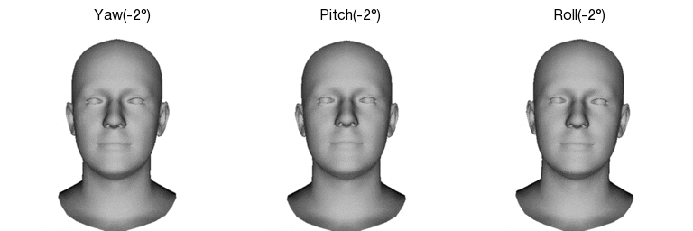
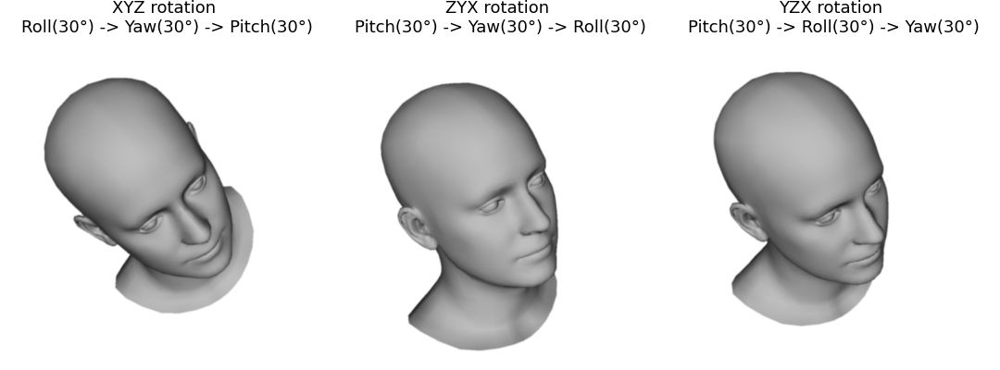

# Rotation representations

This repository contains notebook comparing regression performance of Euler angles, quaternions and 6D represebtation.

## Requirements

To run `euler_visualization.ipynb` you need:

1. Request and download [FLAME model]{https://flame.is.tue.mpg.de/}
2. Install [simple_camera]{https://github.com/kostyaev/simple_camera} library to render triangle meshes.

To run `rotations_performance.ipynb` you need:
1. [Tensorflow 2]{https://www.tensorflow.org}.
2. [Pyquaternion]{https://github.com/KieranWynn/pyquaternion}

